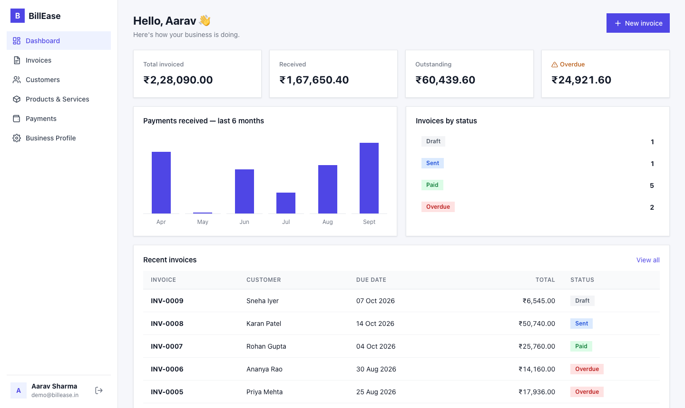
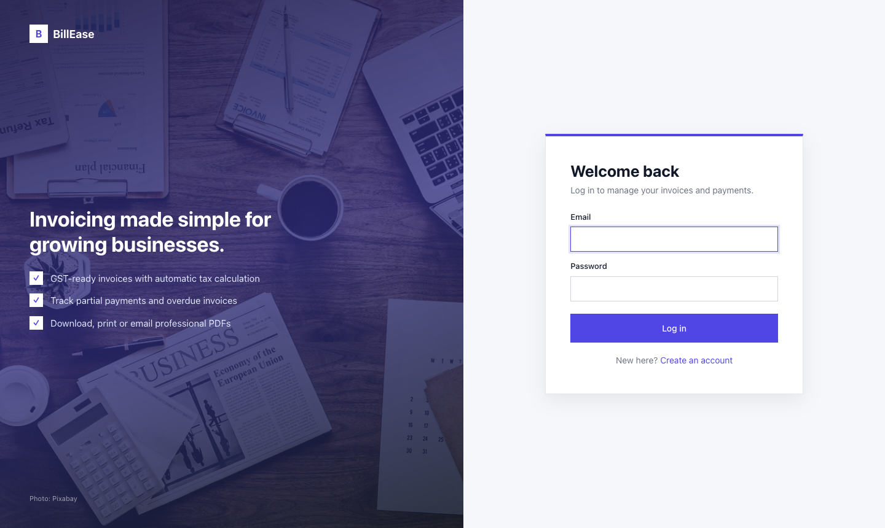
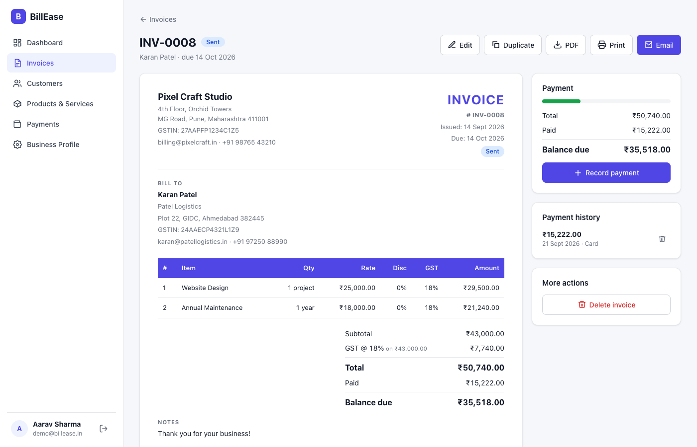
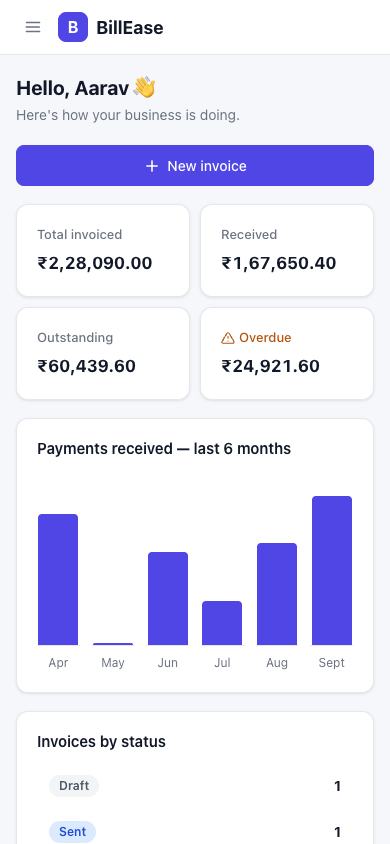
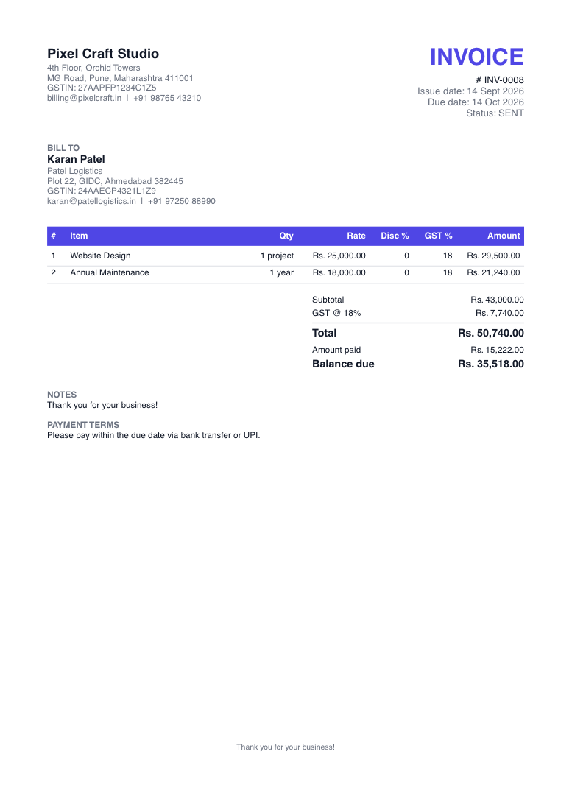

# BillEase — Invoice & Billing Management System

A full-stack web app for small businesses to manage **customers, products/services, invoices and payments** in one place. It also produces **professional GST invoices as PDF**, which you can print, download or email.

> **Demo login:** `demo@billease.in` / `demo123` (created by `npm run seed`)



---

## 1. Problem

Many small businesses and freelancers still bill with Word/Excel templates. This causes:

- invoice numbers that get duplicated or skipped
- mistakes in GST, discount and total calculations done by hand
- no clear view of who has paid, who has paid partly, and whose payment is overdue
- time wasted on formatting, exporting to PDF and attaching invoices to emails
- customer history spread across many files

## 2. Solution

BillEase keeps all billing data in one database and handles the repetitive work automatically:

| Pain point | How BillEase solves it |
|---|---|
| Duplicate invoice numbers | A per-user counter creates unique numbers (`INV-0001`, `INV-0002`, …) that are never reused, even after a delete |
| Calculation mistakes | The server calculates subtotal, line discounts, GST at each rate and the total. The form shows the same numbers live while you type |
| Unknown payment state | Partial payments are tracked. Status changes automatically: **Paid** when fully paid, and **Overdue** once the due date passes |
| PDF & email effort | One click creates a branded A4 PDF (logo, GSTIN, tax breakdown) and emails it with the PDF attached |
| Scattered history | Each customer has a page showing their invoice history, purchase history and balance due |

---

## 3. Features (mapped to the brief)

**Authentication & business profile**
- Register, log in and log out (passwords hashed with bcrypt, JWT sessions)
- Business profile: name, address, GSTIN (format checked), email, phone, **logo upload** (PNG/JPG, 2 MB max)

**Customers**
- Add, edit, delete, **search** (name, email, phone or company) and **filter** (has balance due, fully paid, no invoices)
- Contact & billing details, GSTIN
- Customer page with **invoice history**, **purchase history** (items bought) and totals billed, paid and due
- A customer who still has invoices cannot be deleted, so no invoice loses its customer

**Products & Services**
- Add, edit, delete, search, and filter by type (**product** or **service**)
- Name, description, price, GST rate (0/5/12/18/28%), unit

**Invoices**
- Create, edit, delete and **duplicate** (the copy becomes a new draft with today's date)
- **Unique invoice numbers** generated automatically
- Many line items per invoice: pick a saved product or type a custom item
- Per-line quantity, price, **discount %** and **GST %**, so one invoice can mix **several tax rates**
- Automatic **subtotal, discount, GST breakdown by rate, and grand total**
- Notes, payment terms, issue date and due date (with quick picks: Net 7/15/30/45)
- Status: **Draft → Sent → Paid**, with **Overdue** worked out automatically from the due date

**Payments**
- Record full or **partial payments** (amount, date, method, reference)
- Tracks paid and remaining amounts, with a progress bar
- **Payment history** on each invoice, plus a Payments page covering all invoices
- Overpayment is blocked; deleting a payment recalculates the invoice status

**PDF, print & email**
- Professional **A4 PDF** built on the server with PDFKit
- **Print** from the browser (a print stylesheet prints only the invoice)
- **Email** the invoice with the PDF attached (Nodemailer). If SMTP isn't set up, a free test inbox is used and a preview link is shown

**Search & filtering (invoices)**
- Invoice number or customer name, customer, status, payment status (unpaid, partial, paid), date range, amount range
- Filters are kept in the URL, so dashboard links such as "Overdue" open the list already filtered

**Dashboard**
- Total invoiced, received, outstanding and overdue amounts
- Chart of payments received over the last 6 months, invoice counts by status, recent invoices

**Quality**
- Validation in the browser (instant feedback) **and** on the server (source of truth)
- Friendly error messages, loading spinners, empty states and toast notifications
- Responsive layout: sidebar on desktop, slide-in menu on mobile, tables turn into cards on phones

---

## 4. Technologies & tools

| Layer | Technology | Why |
|---|---|---|
| Frontend | **React 19** + **Vite** | Component-based UI with a fast dev server |
| Routing | **React Router** | Page navigation; filters stored in the URL |
| Styling | **Plain CSS** (one file, CSS variables) | No UI framework to learn; easy to read and theme |
| Backend | **Node.js** + **Express 5** | Simple REST API; async errors are caught automatically |
| Database | **SQLite** (built into Node, `node:sqlite`) | Real relational DB with foreign keys and transactions, and no setup needed |
| Auth | **bcryptjs** + **jsonwebtoken** | Hashed passwords, stateless login tokens |
| PDF | **PDFKit** | Builds the invoice PDF on the server |
| Email | **Nodemailer** | SMTP email with a PDF attachment |
| Uploads | **Multer** | Logo upload with type and size checks |
| Tools | VS Code, Git, Chrome DevTools, Render (hosting) | |
| Images | [Pixabay](https://pixabay.com/) photo ID 3139127 (free licence) | Login/register background, stored locally in `client/public/images` |

---

## 5. Project structure

```
Billing_System/
├── client/                    # React frontend
│   └── src/
│       ├── api.js             # fetch wrapper (adds token, handles errors)
│       ├── auth.jsx           # logged-in user context
│       ├── hooks.js           # useApi (loading/error state), useDebounce
│       ├── utils.js           # money/date formatting, live invoice maths
│       ├── components/        # Layout, Modal, Toast, Icon, CustomerForm, small UI pieces
│       ├── pages/             # Dashboard, Invoices, InvoiceForm, InvoiceView, Customers, …
│       └── index.css          # all styles (responsive + print)
├── server/                    # Express API
│   ├── index.js               # app setup, routes, error handler, serves the React build
│   ├── db.js                  # SQLite connection + table definitions
│   ├── seed.js                # demo data
│   ├── routes/                # auth, business, customers, products, invoices, payments, dashboard
│   └── utils/
│       ├── invoiceCalc.js     # all invoice money maths (single source of truth)
│       ├── invoiceQueries.js  # shared SQL, including the automatic "overdue" status
│       ├── pdf.js             # PDF layout
│       ├── mailer.js          # email sending
│       ├── auth.js            # JWT middleware
│       └── http.js            # error class + validation helpers
├── render.yaml                # deployment config
└── package.json               # root scripts (build / start / seed)
```

---

## 6. Getting started

**Requirements:** Node.js **22.13 or newer**. No database install is needed.

```bash
# 1. Install everything and build the frontend
npm run build

# 2. (optional) load demo data → demo@billease.in / demo123
npm run seed

# 3. Start the app
npm start
```

Open **http://localhost:5050**.

**Development mode** (hot reload), in two terminals:

```bash
npm run dev:server     # API on http://localhost:5050
npm run dev:client     # UI  on http://localhost:5173 (forwards /api to the server)
```

**Configuration:** copy `server/.env.example` to `server/.env`.

| Variable | Purpose |
|---|---|
| `PORT` | Server port (default 5050) |
| `JWT_SECRET` | Secret for signing login tokens. **Set this in production** |
| `SMTP_HOST`, `SMTP_PORT`, `SMTP_USER`, `SMTP_PASS`, `SMTP_FROM` | Real email sending. Leave empty to use the free Ethereal test inbox |

---

## 7. Database design

```
users ──1:1── businesses
  │
  ├──1:N── customers ──1:N── invoices ──1:N── invoice_items ──N:1── products
  │                              │
  └──1:N── products              └──1:N── payments
```

| Table | Key columns |
|---|---|
| `users` | name, email (unique), password_hash, `invoice_counter` |
| `businesses` | name, address, gstin, email, phone, logo |
| `customers` | name, company, email, phone, gstin, billing_address |
| `products` | type (`product`/`service`), name, description, price, tax_rate, unit |
| `invoices` | invoice_number (unique per user), issue/due date, status (`draft`/`sent`/`paid`), notes, terms, subtotal, discount_total, tax_total, total, amount_paid |
| `invoice_items` | description, unit, quantity, price, discount %, tax_rate %, amount |
| `payments` | amount, date, method, note |

**Design decisions**
- **Overdue is calculated, not stored.** SQL works it out on every read (`status = 'sent' AND due_date < today`), so it can never go stale and no background job is needed.
- **Invoice lines copy product details.** Changing or deleting a product does not change invoices already issued.
- **Money is calculated only on the server** (`invoiceCalc.js`). The form repeats the same maths only to show a live preview.
- **Multi-step writes use transactions** (e.g. invoice + items, payment + status), so data stays consistent if something fails.
- **Every query is scoped to the logged-in user**, so one business can never see another's data.

---

## 8. REST API

All endpoints except register and login need the header `Authorization: Bearer <token>`.

| Method | Endpoint | Description |
|---|---|---|
| POST | `/api/auth/register` | Create account |
| POST | `/api/auth/login` | Log in, returns token |
| GET | `/api/auth/me` | Current user |
| GET / PUT | `/api/business` | Get / update business profile |
| POST | `/api/business/logo` | Upload logo (multipart `logo`) |
| GET / POST | `/api/customers?search=` | List / create customers |
| GET / PUT / DELETE | `/api/customers/:id` | Customer with invoice & purchase history / update / delete |
| GET / POST | `/api/products?search=&type=` | List / create products & services |
| PUT / DELETE | `/api/products/:id` | Update / delete |
| GET | `/api/invoices?search=&customer_id=&status=&payment_status=&from=&to=&min=&max=` | Search & filter invoices |
| POST | `/api/invoices` | Create invoice (number generated automatically) |
| GET / PUT / DELETE | `/api/invoices/:id` | Full invoice / update / delete |
| POST | `/api/invoices/:id/duplicate` | Copy as a new draft |
| PATCH | `/api/invoices/:id/status` | Mark as sent / back to draft |
| POST | `/api/invoices/:id/payments` | Record a (partial) payment |
| DELETE | `/api/invoices/:id/payments/:paymentId` | Remove a payment |
| GET | `/api/invoices/:id/pdf` | Download PDF |
| POST | `/api/invoices/:id/email` | Email invoice with PDF attached |
| GET | `/api/payments` | All payments |
| GET | `/api/dashboard` | Dashboard numbers |

---

## 9. Deployment

The app deploys as **one service**: Express serves both the API and the built React app.

**Render (free):**
1. Push this folder to a GitHub repository.
2. On [render.com](https://render.com) choose **New → Blueprint** and pick the repo. `render.yaml` sets everything up.
3. Open the URL Render gives you and log in with the demo account.

> On Render's free plan the disk resets on each restart, so the database is re-seeded with demo data at startup. For permanent data, attach a persistent disk and set `DB_FILE` to a path on it.

**Deployment link:** _add your Render URL here after deploying_

---

## 10. Screenshots



| Invoice | Mobile |
|---|---|
|  |  |


